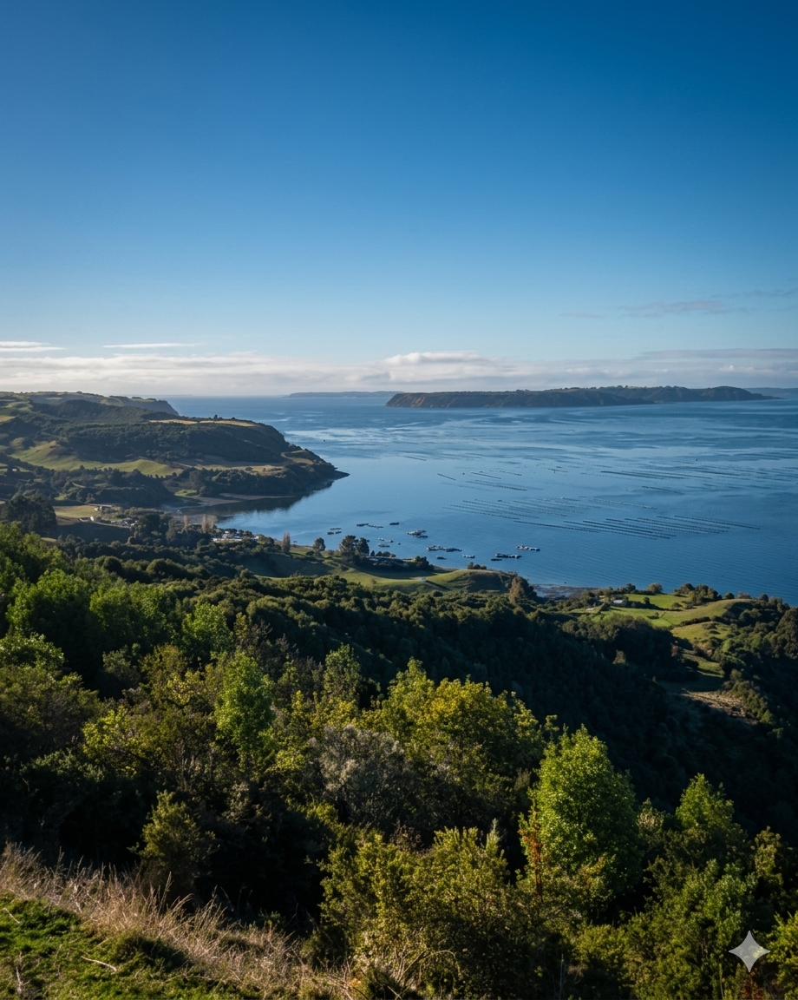

# IMPLEMENTACIÓN DISEÑO + PULIDO DE SECCIONES — GEOTOPOGRAFÍA

## Contexto
Este archivo es una instrucción maestra para Codex.

Base de trabajo: `index(4).html` ya tiene:
- sistema topográfico SVG persistente
- títulos con `data-title-flow`
- sección `El territorio, leído en tres capas` construida hoy como `proof-mosaic`
- sección tipo tabs ya resuelta visualmente en `#casos` con `.cases`, `.cases-tabs`, `.cases-tab`, `.case-panel`, `.case-visual` fileciteturn2file0 fileciteturn2file3

Tu tarea es tomar esa base y **pulir la implementación de diseño** para que la landing quede completamente alineada con la guía de marca aprobada.

---

## Objetivo general
Transformar el HTML actual en una landing editorial-técnica premium que se sienta:

- precisa
- robusta
- contemporánea
- clara
- territorial
- técnica
- premium
- no genérica
- no corporativa aburrida

La marca no debe comunicar “solo hacemos levantamientos”.
Debe comunicar:

- certeza
- lectura técnica del territorio
- información confiable para decidir
- precisión para proyectar y construir
- soporte territorial para diseño y ejecución

Idea fuerza:

**No venden puntos; venden certeza.**

---

## Regla máxima de implementación
No rehacer la web desde cero.
Debes **trabajar sobre la estructura ya existente** de `index(4).html`, mejorando:

1. paleta
2. contraste
3. balance cromático general
4. módulos
5. secciones
6. CTAs
7. sistema de tabs
8. tono visual editorial-técnico

Mantén:
- la arquitectura general del documento
- la lógica responsive actual
- el sistema topográfico SVG
- la lógica de reveal y de temas por sección

Pero ajusta lo necesario para que el resultado final se vea **mucho más consistente con la guía de diseño**.

---

# 1. PALETA OFICIAL OBLIGATORIA

Usar exclusivamente esta paleta como sistema maestro:

- `#FDB813` → amarillo principal
- `#1A1A1A` → negro carbón
- `#FFFFFF` → blanco
- `#E6E8EB` → gris técnico

## Acción obligatoria
Reescribe los tokens de color actuales del CSS para que dependan de esta paleta.

### Crear o reemplazar variables base por algo de este tipo

```css
:root {
  --color-yellow: #FDB813;
  --color-black: #1A1A1A;
  --color-white: #FFFFFF;
  --color-gray: #E6E8EB;

  --text-primary: #1A1A1A;
  --text-secondary: rgba(26, 26, 26, 0.72);
  --text-on-dark: rgba(255, 255, 255, 0.92);
  --text-on-dark-soft: rgba(255, 255, 255, 0.72);

  --line-soft: rgba(26, 26, 26, 0.08);
  --line-mid: rgba(26, 26, 26, 0.14);
  --line-dark: rgba(255, 255, 255, 0.14);
}
```

## Prohibiciones
Eliminar la dependencia visual de la paleta cálida/beige actual del archivo original.
No seguir usando como base dominante:
- `paper-50`
- `paper-100`
- `paper-200`
- `accent-500/600` tipo marrón/dorado viejo

La nueva identidad no debe verse sepia.
Debe verse:
- más limpia
- más contrastada
- más técnica
- más contemporánea

---

# 2. BALANCE CROMÁTICO GLOBAL — REGLA 33 / 33 / 33

La composición general debe tender a este equilibrio:

- 33% negro
- 33% blanco / gris claro
- 33% amarillo

## Esto significa concretamente

### No dejar:
- demasiadas secciones oscuras consecutivas
- demasiadas secciones claras consecutivas
- el amarillo reducido a detalles mínimos

### Sí hacer:
- hero oscuro
- una sección clara
- una sección amarilla o con presencia amarilla real
- otra sección blanca/gris
- otra oscura
- CTA final con protagonismo claro o amarillo según convenga

## Acción obligatoria
Redistribuye visualmente los fondos de las secciones actuales para que el sitio no se cargue hacia negro ni hacia beige claro.

### Propuesta concreta de balance
- `hero` → negro carbón + overlays topográficos
- `confidence strip` → blanco
- `proof / tres capas` → blanco/gris técnico
- `método` → amarillo dominante con texto negro
- `servicios` → blanco
- `casos` → negro carbón
- `entregables` → gris técnico o blanco
- `preguntas` → blanco
- `contacto / CTA` → amarillo con bloque negro interno o viceversa
- `footer` → negro carbón

---

# 3. TIPOGRAFÍA — MANTENER DOBLE SISTEMA

## Mantener lógica ya iniciada
- serif editorial para títulos
- sans técnica para cuerpo y UI

## Regla
Mantener `Fraunces` o equivalente para titulares principales.
Mantener `Inter` para cuerpo y UI.
Mantener `JetBrains Mono` para micro-etiquetas, coordenadas, kicks, labels técnicas.

## Ajustes buscados

### Títulos
Deben verse:
- más editoriales
- más contundentes
- con mejor contraste
- con mejor aire vertical

### Cuerpo
Debe verse:
- técnico
- claro
- cómodo
- jamás pequeño de más

## Acción obligatoria
Revisar tamaños, pesos y espaciados para que:
- H1 y H2 tengan más protagonismo
- párrafos no se vean apagados
- botones y tabs se vean más firmes y menos blandos

---

# 4. TONO VISUAL GENERAL

La interfaz debe sentirse como una mezcla entre:
- brochure premium
- dashboard editorial técnico
- firma especializada en lectura territorial

## Debe comunicar
- autoridad
- criterio técnico
- lectura del paisaje
- precisión contemporánea

## Evitar que se sienta
- startup tech genérica
- agencia creativa cualquiera
- empresa industrial vieja
- sitio bonito sin criterio técnico

---

# 5. SISTEMA TOPOGRÁFICO — MANTENER Y AFINAR

El HTML actual ya tiene un sistema SVG topográfico persistente en fondo y temas por sección en `body.theme-*` fileciteturn2file3.

## Acción obligatoria
Conservarlo, pero pulirlo según estas reglas:

### Curvas topográficas
- negro carbón con más presencia en fondos claros
- gris técnico para soporte sutil
- amarillo muy fino para acentos
- nunca pixelado
- nunca muy cargado

### Por sección
- en hero: más dramático, visible y premium
- en secciones claras: más sutil
- en CTA: convergencia ligera o sensación de cierre

### Legibilidad
Las curvas nunca deben competir con el texto.

---

# 6. BOTONES Y CTA — REHACER SISTEMA VISUAL

Los botones actuales deben migrar al nuevo sistema cromático.

## Crear tres familias principales

### A. CTA principal
Fondo amarillo `#FDB813`
Texto negro `#1A1A1A`

### B. CTA oscuro
Fondo negro `#1A1A1A`
Texto blanco `#FFFFFF`

### C. CTA neutro
Fondo blanco
Borde negro o gris técnico
Texto negro

## Estilo
- firmes
- rectangulares o radio suave
- premium
- técnicos
- sin glossy
- sin gradientes efectistas
- sin sombra inflada

## Acción obligatoria
Rehacer `.btn-primary`, `.btn-gold`, `.btn-ghost`, `.btn-ghost-light` para que respondan a este sistema.

### Regla importante
El botón principal del sitio ya no debe sentirse “dorado”.
Debe sentirse **amarillo editorial-técnico**.

---

# 7. HEADER Y NAV

El topbar ya existe.

## Acción obligatoria
Pulir el header para que:
- en hero oscuro funcione impecable en blanco / amarillo
- en fondos claros funcione en negro / gris técnico
- el CTA del header sea claramente visible
- la navegación se vea más premium y menos genérica

## Ajustes buscados
- mejor contraste
- mejor consistencia de hover
- menos sensación de UI estándar
- más sensación de marca técnica premium

---

# 8. HERO — AJUSTES DE DISEÑO

El hero ya existe y debe conservarse como bloque de mayor impacto.

## Acción obligatoria
Pulir el hero para que encaje mejor con la guía.

### Debe tener
- fondo negro carbón
- overlays topográficos
- gran titular serif
- palabra estratégica en amarillo
- subtítulo técnico claro
- CTA principal amarillo
- CTA secundario oscuro o transparente bien resuelto

### Ajustes concretos
- revisar si el H1 necesita mejor composición de saltos de línea
- reforzar el statement para que se sienta más marca y menos sólo servicio
- mejorar el contraste de la bajada
- mantener el fondo topográfico activo

---

# 9. SECCIÓN “EL TERRITORIO, LEÍDO EN TRES CAPAS” — CAMBIO ESTRUCTURAL OBLIGATORIO

La sección actual usa un `proof-mosaic` con tres tarjetas visuales: ortoimagen, MDT / nube de puntos y control GNSS fileciteturn2file0.

## Cambio obligatorio
**Eliminar la lógica actual de mosaico estático como experiencia principal**.

Y reemplazarla por un sistema inspirado en la sección de tabs existente en `#casos`, que ya usa:
- `.cases-tabs`
- `.cases-tab`
- `.case-panel`
- `.case-visual` fileciteturn2file6

## Objetivo
Que la sección funcione como una sola gran narrativa con:
- 3 botones
- 1 contenido principal dinámico
- 1 imagen principal dinámica
- bullets o entregables dinámicos
- una sensación más premium, didáctica y controlada

## Estructura deseada
Crear una sección nueva o refactorizar la actual para que quede así:

### Título y bajada
Mantener:
- `Prueba visual`
- `El territorio, leído en tres capas.`

### Sistema de botones
3 botones:
- `Ortoimagen`
- `MDT / Nube de puntos`
- `Control GNSS`

### Al hacer click en cada botón
Cambiar:
- el subtítulo principal
- la bajada
- los bullets
- la imagen principal
- opcionalmente una micro-etiqueta técnica

## Contenido sugerido por botón

### 1. Ortoimagen
**Título:**
Lectura territorial clara, antes de proyectar.

**Texto:**
Base georreferenciada para leer caminos, bordes, ocupación, contexto y relación real entre terreno y proyecto. Sirve para mirar el territorio con claridad antes de diseñar o intervenir.

**Bullets:**
- GeoTIFF listo para lectura y trazado
- Contexto territorial real y medible
- Base útil para arquitectura, loteos y diagnóstico

**Imagen asociada:**
`imagenes/02.png`

**Label técnica:**
`ORTOIMAGEN · GEOTIFF`

---

### 2. MDT / Nube de puntos
**Título:**
Superficie digital para medir, modelar y decidir.

**Texto:**
La nube de puntos y el MDT convierten el levantamiento en una base útil para cubicaciones, secciones, pendientes, escorrentías y lectura precisa de relieve.

**Bullets:**
- Modelo de terreno para Civil 3D, QGIS o CAD
- Lectura de pendientes, cortes y escurrimientos
- Base para cubicaciones y modelado técnico

**Imagen asociada:**
`imagenes/07.png`

**Label técnica:**
`MDT · NUBE DE PUNTOS`

---

### 3. Control GNSS
**Título:**
Precisión verificada donde realmente importa.

**Texto:**
El control GNSS ancla el levantamiento al terreno real. No es sólo captura aérea: es validación independiente para asegurar que la información sirva para proyectar, comparar y construir con confianza.

**Bullets:**
- Puntos de control geodésico en terreno
- Validación cruzada del vuelo y los entregables
- Precisión centimétrica con trazabilidad técnica

**Imagen asociada:**
`imagenes/05.png`

**Label técnica:**
`CONTROL GNSS EN TERRENO`

---

## Diseño visual de esta nueva sección
Debe parecer hermana visual de `#casos`, pero no copia exacta.

### Debe verse
- más clara
- más técnica
- más modular
- más premium

### Fondo recomendado
Blanco o gris técnico, con curvas topográficas muy sutiles.

### Layout recomendado
Dos columnas:
- izquierda: contenido dinámico
- derecha: imagen dinámica

O bien:
- arriba título + botones
- abajo grid 2 columnas con contenido + imagen

## Regla fuerte
No dejar tres cards chicas simultáneas como experiencia principal.
La decisión del usuario debe pasar por **tocar un botón y ver cambiar la capa técnica**.

---

# 10. REUTILIZAR EL SISTEMA DE TABS DE LA OTRA SECCIÓN

La referencia visual y funcional para este cambio es la sección existente “A cada proyecto le hablamos en su idioma”, que ya tiene tabs por perfil y un panel dinámico asociado fileciteturn2file6.

## Acción obligatoria
Reutilizar la lógica JS y la arquitectura CSS de esa sección, pero adaptándola a la nueva sección de las tres capas.

## Pedidos concretos

### Crear clases nuevas específicas
No mezclar directamente con `.cases-*` si eso ensucia semántica.
Usar algo como:

- `.layers-section`
- `.layers-tabs`
- `.layers-tab`
- `.layers-panel`
- `.layers-visual`
- `.layers-meta`

### Pero sí reutilizar
- patrón de activación
- patrón de estado `.is-active`
- patrón de transición suave
- accesibilidad básica `aria-selected`, `role="tab"`, `role="tabpanel"`

---

# 11. MÉTODO — DARLE PRESENCIA AMARILLA REAL

La sección `Método` hoy es clara con tarjetas blancas fileciteturn2file4.

## Cambio obligatorio
Reinterpretarla con presencia amarilla real para ayudar al balance 33/33/33.

## Propuesta
- fondo amarillo completo o dominante
- tarjetas blancas o negras según contraste
- numeración técnica muy clara
- línea editorial fuerte

## Debe sentirse
- sistema
- proceso
- estándar
- trazabilidad

No debe sentirse decorativa.

---

# 12. SERVICIOS — LIMPIAR Y ROBUSTECER

La sección de servicios ya existe con cards. Debe mantenerse, pero ajustarse.

## Acción obligatoria
- eliminar cualquier sensación de “card genérica SaaS”
- aumentar contraste
- reforzar grid brochure
- usar mejor la paleta oficial
- incluir micro-detalles técnicos en amarillo o gris técnico

## Visualmente
Debe verse más como módulos editoriales premium.

---

# 13. CASOS — MANTENER BASE, PULIR COLORES

La sección `#casos` ya funciona como sistema de tabs sobre fondo oscuro y es una muy buena base fileciteturn2file6.

## Acción obligatoria
Pulirla con la nueva guía:
- fondo negro carbón real `#1A1A1A`
- amarillo oficial `#FDB813`
- texto blanco puro o blanco suavizado
- tabs más firmes
- mejor contraste en estados activos

## Regla
Debe seguir siendo una de las secciones más premium del sitio.

---

# 14. ENTREGABLES

La sección de entregables debe verse más técnica y clara.

## Acción obligatoria
- usar gris técnico o blanco como base
- usar negro para títulos
- usar amarillo sólo para detalles importantes
- mejorar jerarquía entre extensión, nombre y descripción

Debe sentirse como una matriz técnica bien presentada.

---

# 15. FAQ

Mantener la sección, pero pulirla para que:
- no se vea débil
- tenga mejor contraste
- tenga mejor aire
- se sienta técnica y elegante

---

# 16. CTA FINAL / CONTACTO

La sección `#contacto` hoy ya existe como dual CTA oscuro fileciteturn2file2.

## Cambio obligatorio
Rebalancearla para que el amarillo tenga protagonismo real en la parte final del recorrido.

## Opciones válidas

### Opción A
Fondo amarillo con tarjetas internas negras.

### Opción B
Fondo negro con bloque principal amarillo.

## Regla
El cierre debe sentirse:
- firme
- memorable
- premium
- claro
- orientado a acción

No debe sentirse como una caja más del mismo sistema oscuro.

---

# 17. FOOTER

## Acción obligatoria
Pasar el footer a negro carbón puro y pulirlo con:
- texto blanco
- detalles en amarillo
- líneas sutiles
- wordmark final con presencia editorial fuerte

---

# 18. AJUSTES RESPONSIVE

Todo lo anterior debe respetar mobile.

## Reglas específicas

### En mobile
- bajar complejidad topográfica
- mantener contraste fuerte
- tabs de la sección tres capas deben wrappear bien
- panel dinámico debe apilar contenido e imagen
- no generar bloques demasiado altos sin jerarquía
- tipografía debe seguir siendo premium pero legible

---

# 19. ACCESIBILIDAD Y UX

## Obligatorio
- mantener soporte de `prefers-reduced-motion`
- no hacer transiciones agresivas
- asegurar contraste AA razonable
- no usar overlays que dificulten lectura
- botones y tabs con foco visible

---

# 20. IMPLEMENTACIÓN TÉCNICA SOLICITADA

## Debes modificar directamente
- HTML
- CSS
- JS

## Entregable esperado
Quiero que Codex entregue:

1. el `index.html` actualizado
2. comentarios claros en el código donde:
   - reemplazó la sección `proof-mosaic`
   - redefinió la paleta
   - ajustó los botones
   - reforzó el balance cromático
3. sin romper la lógica existente de reveal, theme sections ni responsive

---

# 21. CAMBIO ESPECÍFICO DE LA SECCIÓN TRES CAPAS — HTML DE REFERENCIA

Puedes reemplazar la sección actual por una estructura de este tipo:

```html
<section class="block shell topo-section layers-section" data-topo-theme="tech" aria-labelledby="layers-title">
  <div class="section-head">
    <div class="section-title-group topo-reveal" data-title-flow="right">
      <span class="kicker">Prueba visual</span>
      <h2 id="layers-title" class="section-title">El territorio, leído en tres capas.</h2>
    </div>
    <p class="reveal" data-delay="1">
      Cada levantamiento se compone como un producto técnico: una capa para leer,
      otra para modelar y otra para validar en terreno.
    </p>
  </div>

  <div class="layers-tabs" role="tablist" aria-label="Capas del levantamiento">
    <button class="layers-tab is-active" type="button" role="tab" aria-selected="true" data-layer="ortho">Ortoimagen</button>
    <button class="layers-tab" type="button" role="tab" aria-selected="false" data-layer="mdt">MDT / Nube de puntos</button>
    <button class="layers-tab" type="button" role="tab" aria-selected="false" data-layer="gnss">Control GNSS</button>
  </div>

  <div class="layers-stage">
    <div class="layers-copy">
      <span class="kicker layers-kicker" id="layers-kicker">ORTOIMAGEN · GEOTIFF</span>
      <h3 id="layers-panel-title">Lectura territorial clara, antes de proyectar.</h3>
      <p id="layers-panel-text">
        Base georreferenciada para leer caminos, bordes, ocupación, contexto y relación real entre terreno y proyecto.
      </p>
      <ul class="layers-list" id="layers-panel-list">
        <li>GeoTIFF listo para lectura y trazado</li>
        <li>Contexto territorial real y medible</li>
        <li>Base útil para arquitectura, loteos y diagnóstico</li>
      </ul>
    </div>

    <figure class="layers-visual">
      
    </figure>
  </div>
</section>
```

---

# 22. CAMBIO ESPECÍFICO DE LA SECCIÓN TRES CAPAS — JS DE REFERENCIA

Implementar una lógica similar a esta:

```js
const layersData = {
  ortho: {
    kicker: 'ORTOIMAGEN · GEOTIFF',
    title: 'Lectura territorial clara, antes de proyectar.',
    text: 'Base georreferenciada para leer caminos, bordes, ocupación, contexto y relación real entre terreno y proyecto. Sirve para mirar el territorio con claridad antes de diseñar o intervenir.',
    bullets: [
      'GeoTIFF listo para lectura y trazado',
      'Contexto territorial real y medible',
      'Base útil para arquitectura, loteos y diagnóstico'
    ],
    image: 'imagenes/02.png',
    alt: 'Vista aérea de borde costero e isla en Chiloé capturada por drone'
  },
  mdt: {
    kicker: 'MDT · NUBE DE PUNTOS',
    title: 'Superficie digital para medir, modelar y decidir.',
    text: 'La nube de puntos y el MDT convierten el levantamiento en una base útil para cubicaciones, secciones, pendientes, escorrentías y lectura precisa de relieve.',
    bullets: [
      'Modelo de terreno para Civil 3D, QGIS o CAD',
      'Lectura de pendientes, cortes y escurrimientos',
      'Base para cubicaciones y modelado técnico'
    ],
    image: 'imagenes/07.png',
    alt: 'Control de misión de drone con trazado de vuelo sobre el terreno'
  },
  gnss: {
    kicker: 'CONTROL GNSS EN TERRENO',
    title: 'Precisión verificada donde realmente importa.',
    text: 'El control GNSS ancla el levantamiento al terreno real. No es sólo captura aérea: es validación independiente para asegurar que la información sirva para proyectar, comparar y construir con confianza.',
    bullets: [
      'Puntos de control geodésico en terreno',
      'Validación cruzada del vuelo y los entregables',
      'Precisión centimétrica con trazabilidad técnica'
    ],
    image: 'imagenes/05.png',
    alt: 'Técnico con equipo topográfico validando puntos en terreno'
  }
};
```

## Y luego
- actualizar texto
- actualizar imagen
- actualizar estado activo
- actualizar `aria-selected`
- opcionalmente agregar fade corto

---

# 23. CAMBIO ESPECÍFICO DE LA SECCIÓN TRES CAPAS — CSS DE REFERENCIA

El look visual debe inspirarse en `#casos`, pero más claro y editorial.

## Debe incluir
- tabs firmes
- stage de dos columnas
- bloque de texto amplio
- bullets limpios
- imagen grande con buen radio
- fondo blanco o gris técnico
- detalles amarillos discretos

Puedes crear algo de este tipo:

```css
.layers-section {
  background: var(--color-white);
}

.layers-tabs {
  display: flex;
  flex-wrap: wrap;
  gap: 10px;
  margin-bottom: 28px;
}

.layers-tab {
  min-height: 48px;
  padding: 0 18px;
  border-radius: 999px;
  border: 1px solid rgba(26,26,26,.14);
  background: #fff;
  color: #1A1A1A;
  font-weight: 600;
}

.layers-tab.is-active {
  background: #FDB813;
  color: #1A1A1A;
  border-color: #FDB813;
}

.layers-stage {
  display: grid;
  grid-template-columns: 1fr 1fr;
  gap: 32px;
  align-items: center;
}

.layers-copy {
  display: grid;
  gap: 18px;
}

.layers-copy h3 {
  font-size: clamp(1.9rem, 3vw, 3rem);
  line-height: 1.02;
}

.layers-list {
  display: grid;
  gap: 10px;
}

.layers-list li {
  padding: 12px 0;
  border-top: 1px solid rgba(26,26,26,.08);
}

.layers-visual {
  aspect-ratio: 4 / 3;
  overflow: hidden;
  border-radius: 28px;
  background: #E6E8EB;
}

.layers-visual img {
  width: 100%;
  height: 100%;
  object-fit: cover;
}

@media (max-width: 900px) {
  .layers-stage {
    grid-template-columns: 1fr;
  }
}
```

---

# 24. COSAS QUE NO HACER

No hacer esto:
- dejar la paleta beige antigua mezclada con la nueva
- dejar el amarillo sólo en microdetalles
- seguir con demasiadas secciones oscuras seguidas
- dejar la sección de tres capas como mosaico estático
- usar degradados “gold” llamativos
- cargar demasiado las curvas topográficas
- meter sombras pesadas o estética SaaS genérica
- romper la lógica responsive ya buena del archivo

---

# 25. CRITERIO FINAL DE ÉXITO

La implementación final debe hacer que la landing se vea:

- más marca
- más premium
- más técnica
- más ordenada
- más coherente con la propuesta aprobada
- más editorial
- más contrastada
- más memorable

Y en especial, la sección `El territorio, leído en tres capas` debe quedar claramente mejor que ahora:
- más didáctica
- más elegante
- más interactiva
- más clara
- más alineada con el sistema de la otra gran sección de tabs

---

# 26. INSTRUCCIÓN CORTA FINAL PARA EJECUCIÓN

Actualiza `index(4).html` para alinearlo a la guía de rebranding de GeoTopografía usando exclusivamente la paleta `#FDB813`, `#1A1A1A`, `#FFFFFF` y `#E6E8EB`. Rebalancea el sitio para acercarlo a una distribución visual 33/33/33 entre amarillo, blanco y negro. Mantén la arquitectura actual, el sistema topográfico SVG y la lógica responsive, pero pule hero, botones, header, servicios, método, casos, CTA y footer para que la interfaz se vea más editorial-técnica, robusta y premium. Reemplaza la sección `El territorio, leído en tres capas` por un sistema dinámico con 3 botones inspirado en la lógica de tabs de la sección `A cada proyecto le hablamos en su idioma`, cambiando texto, bullets e imagen según la capa activa: Ortoimagen, MDT / Nube de puntos y Control GNSS.
